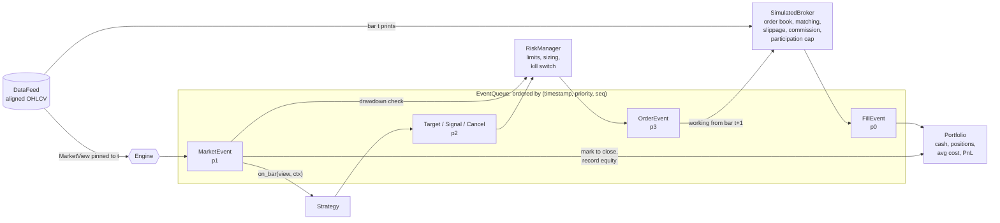
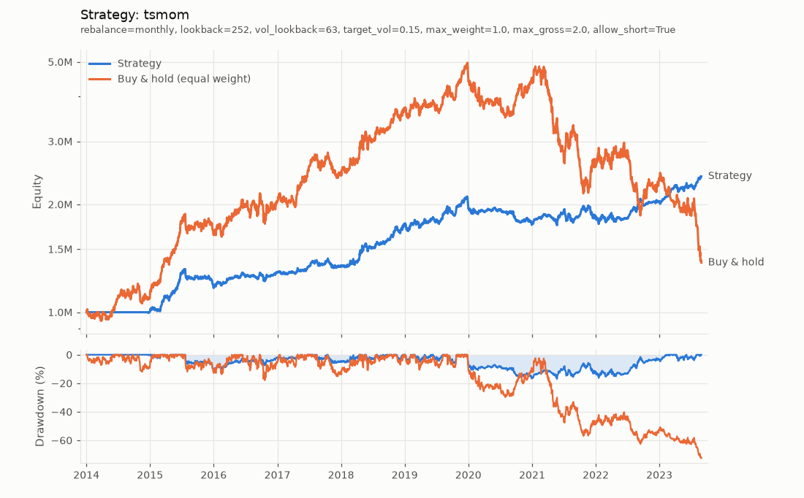

# event-backtester

[](https://github.com/houssammehdi/event-backtester/actions/workflows/ci.yml)
[](LICENSE)
[](pyproject.toml)

**An event-driven backtesting engine for systematic trading strategies, built for
correctness first.** Strategies only ever see a read-only view of the market that ends
at the current bar, so look-ahead bias is ruled out by construction rather than by
convention. Orders go through a simulated broker that fills market, limit, stop and
stop-limit orders at bar level, handles opening gaps, applies slippage and commission
models, and caps fills at a share of bar volume. The portfolio accounting is checked
against two identities on every bar. On the research side there are grid search,
walk-forward optimisation with a stitched out-of-sample curve, the deflated Sharpe
ratio for multiple testing, and a vectorized fast path that tests show matches the
event engine to floating-point precision. Everything runs offline on a seeded,
regime-switching synthetic market.

> **Disclaimer.** This is research software. Nothing here is investment advice, and
> results on synthetic data say nothing about how any strategy will do in real markets.

---

## Contents

- [Features](#features)
- [Architecture](#architecture)
- [Quickstart](#quickstart)
- [Example output](#example-output)
- [Writing a strategy](#writing-a-strategy)
- [Execution model](#execution-model)
- [Metrics](#metrics)
- [Research tools](#research-tools)
- [Design notes and trade-offs](#design-notes-and-trade-offs)
- [Testing](#testing)
- [Limitations](#limitations)
- [Project layout](#project-layout)
- [License](#license)

## Features

- **Event loop.** `FillEvent`, `MarketEvent`, `SignalEvent` / `TargetEvent` /
  `CancelEvent` and `OrderEvent` go through one priority queue ordered by
  `(timestamp, priority, sequence)`. The `Engine` connects DataFeed, Strategy,
  RiskManager, Broker and Portfolio.
- **No look-ahead.** A `MarketView` is pinned to one bar and cannot be changed. Its
  arrays are read-only NumPy views that end at that bar, and asking for a later
  timestamp raises `LookAheadError`. A test checks that cutting the data off after bar
  *k* leaves every result up to bar *k* exactly the same.
- **Data.** Multi-symbol OHLCV on a shared calendar with missing bars handled
  (NaN plus forward-filled valuation), validation, a CSV loader (long format or one
  file per symbol) and a **synthetic generator**: regime-switching GBM with Poisson
  jumps landing as overnight gaps, and exact Brownian-bridge highs and lows.
- **Orders and execution.** Market, limit, stop and stop-limit orders. DAY and GTC
  time in force. Market orders fill at the next open; other orders fill intrabar with
  gap handling. Slippage is fixed bps or square-root impact; commission is per share
  (with a minimum and a cap) or bps. Partial fills are capped by bar-volume
  participation.
- **Portfolio.** Long and short positions, average cost, realized and unrealized PnL,
  commissions, short borrow fees and a mark-to-market equity curve. Two accounting
  identities are checked on every bar and property-tested with Hypothesis.
- **Sizing.** Fixed fractional, fixed risk (stop distance), volatility targeting,
  target weights with a rebalance band, and lot rounding.
- **Risk.** Max position weight, max gross leverage, no-short mode, and a max-drawdown
  kill switch that cancels everything, flattens the book and halts the strategy.
- **Analytics.** Total return, CAGR, volatility, Sharpe, Sortino, max drawdown and its
  duration, Calmar, hit rate, profit factor, average win and loss, turnover, exposure,
  round-trip trade log, and beta, alpha, IR and tracking error against buy-and-hold.
- **Research.** Grid search; rolling or anchored walk-forward with an embargo gap; the
  probabilistic and deflated Sharpe ratio; a vectorized fast path with a parity test
  against the event engine.
- **Strategies.** Dual SMA crossover, time-series momentum with volatility targeting,
  cross-sectional momentum rotation (top-k, monthly), Bollinger mean reversion, and a
  Donchian breakout example that uses stop orders.
- **CLI.** `backtest run | walkforward | generate | strategies`.

## Architecture



What happens on each bar `t`:

1. The broker matches orders placed on earlier bars against bar `t` (open, high, low
   and volume) and emits `FillEvent`s (priority 0).
2. A `MarketEvent` for `t` is queued behind them (priority 1). When it is handled, the
   portfolio is marked to the close, equity is recorded, the kill switch is checked and
   the strategy's `on_bar(view, ctx)` runs, with fills from bar `t` already booked.
3. What the strategy asks for comes back as `TargetEvent` / `SignalEvent` /
   `CancelEvent` (priority 2). The risk manager clips, sizes or rejects them.
4. Approved `OrderEvent`s (priority 3) go to the broker. **The first bar they can
   execute on is `t + 1`.**

Because the queue orders work by priority and not by call order, "fills before
decisions, decisions before orders" holds everywhere, including fills produced by the
kill switch and orders placed from `on_fill` hooks.

## Quickstart

```bash
git clone https://github.com/houssammehdi/event-backtester.git
cd event-backtester
python -m venv .venv && source .venv/bin/activate
pip install -e ".[dev,plot]"

backtest run --strategy tsmom --symbols 5 --years 10 --seed 42
backtest walkforward --strategy tsmom --symbols 5 --years 10 --seed 42
backtest strategies                        # list strategies and their parameters
backtest generate --out data/syn.csv       # write synthetic data as CSV
backtest run --strategy sma --csv data/syn.csv -p fast=20 -p slow=100 --plot out.png
```

From Python:

```python
from backtester import (
    BpsCommission,
    DataFeed,
    Engine,
    FixedBpsSlippage,
    RiskLimits,
    SimulatedBroker,
    generate_ohlcv,
)
from backtester.strategies import TimeSeriesMomentum

feed = DataFeed(generate_ohlcv(n_symbols=5, years=10, seed=42))  # or DataFeed.from_csv(path)
broker = SimulatedBroker(FixedBpsSlippage(2.0), BpsCommission(1.0), max_participation=0.10)
engine = Engine(
    feed,
    TimeSeriesMomentum(lookback=252, target_vol=0.15),
    broker=broker,
    risk=RiskLimits(max_gross_leverage=2.0, max_drawdown=0.35),
)
result = engine.run()
print(result.report())
result.trades().tail()  # round-trip trade log (DataFrame)
result.plot("equity.png")  # needs the [plot] extra
```

Scripts in [`examples/`](examples) all run offline:

| Script | What it shows |
|---|---|
| `quickstart.py` | TSMOM with costs, risk limits and invariant checks |
| `custom_strategy.py` | A Donchian breakout built on stop orders, fixed-risk sizing and trailing stops |
| `compare_strategies.py` | All built-in strategies on the same market |
| `walk_forward.py` | Walk-forward optimisation of cross-sectional momentum |
| `vectorized_parity.py` | Event engine vs vectorized fast path: speed and agreement |
| `seed_study.py` | Each strategy across 20 synthetic markets (how much is luck?) |

## Example output

Real output of the exact command below. The default costs are 2 bps slippage, 1 bps
commission and 10 % max participation; gross leverage is capped at 2.

```console
$ backtest run --strategy tsmom --symbols 5 --years 10 --seed 42
Strategy: tsmom (rebalance=monthly, lookback=252, vol_lookback=63, target_vol=0.15, max_weight=1.0, max_gross=2.0, allow_short=True)
Period:   2014-01-02 -> 2023-08-30  (2520 bars, 5 symbols)
Capital:  1,000,000 -> 2,394,940

Performance             Strategy  Buy & hold (EW)
----------------------  --------  ---------------
Total return             139.49%           37.57%
CAGR                       9.13%            3.24%
Annual volatility          9.68%           24.94%
Sharpe ratio                0.95             0.25
Sortino ratio               1.40
Max drawdown              16.96%           72.35%
Max DD duration (bars)       816
Calmar ratio                0.54

Versus benchmark
------------------  ------
Beta                  0.04
Alpha (annualised)   8.96%
Correlation           0.10
Tracking error      25.84%
Information ratio     0.11

Trading
----------------------  ----------
Round trips (closed)            48
Hit rate                     39.6%
Profit factor                 2.01
Average win              59,381.37
Average loss            -19,398.20
Average bars held            188.3
Turnover (annual)             178%
Average gross exposure       53.4%
Time in market               90.0%

Costs
----------  --------
Commission  2,807.21
Slippage    5,614.51
Borrow          0.00

Risk actions logged: 0
Execution: next-bar open / intrabar, slippage=FixedBpsSlippage(bps=2.0), commission=BpsCommission(bps=1.0), max participation=0.1
Engine: 2520 bars x 5 symbols in 0.39s
```

The chart was drawn by the project's own plotting code, from
`backtest run --strategy tsmom --symbols 5 --years 10 --seed 42 --plot docs/equity_curve.png`:



**Read this with the seed study in mind.** Seed 42 is one draw of a synthetic history,
and a good one for TSMOM. `python examples/seed_study.py` runs every strategy on seeds
0-19 (fast path, same costs):

```text
Sharpe ratios across 20 seeds (5 symbols, 10 years, 2 bps + 1 bps costs)
strategy    mean Sharpe   std    min   max  beats B&H
----------  -----------  ----  -----  ----  ---------
sma                0.26  0.37  -0.42  0.80        55%
tsmom              0.24  0.28  -0.29  0.64        40%
xsmom              0.32  0.39  -0.54  1.03        65%
bollinger         -0.20  0.35  -0.82  0.60        15%
buy & hold         0.27  0.37  -0.47  1.01
```

On this generator the trend-following strategies roughly match buy-and-hold on
average, with different risk profiles. Mean reversion loses, as you would expect on
persistent-regime GBM. The 0.95 Sharpe above sits at the top of the distribution.

### Walk-forward

```console
$ backtest walkforward --strategy tsmom --symbols 5 --years 10 --seed 42
Walk-forward: tsmom  grid: lookback=[63, 126, 252], target_vol=[0.1, 0.2]
6 windows, train=756 bars, test=252 bars, rolling, gap=0

OOS window                             chosen params  IS Sharpe  IS DSR  OOS Sharpe  OOS return
----------------------  ----------------------------  ---------  ------  ----------  ----------
2017-11-14..2018-10-31  lookback=252, target_vol=0.1       1.21    0.91        2.06      16.66%
2018-11-01..2019-10-18  lookback=252, target_vol=0.2       1.15    0.82        1.02      16.58%
2019-10-21..2020-10-06  lookback=252, target_vol=0.2       1.30    0.91       -0.45      -6.53%
2020-10-07..2021-09-23  lookback=252, target_vol=0.2       0.95    0.81        0.35       3.87%
2021-09-24..2022-09-12  lookback=126, target_vol=0.2       0.53    0.75        0.59       7.72%
2022-09-13..2023-08-30  lookback=126, target_vol=0.2       0.48    0.69        0.89      13.13%

Stitched out-of-sample   Strategy  Buy & hold (EW)
-----------------------  --------  ---------------
Total return               60.91%          -49.90%
CAGR                        8.25%          -10.88%
Sharpe ratio                 0.65            -0.34
Max drawdown               21.72%           74.89%
Mean in-sample Sharpe        0.94
Walk-forward efficiency      0.69

Note: the best of 6 configurations was selected in-sample. Selection inflates performance; the deflated Sharpe ratio (DSR) is the probability that the chosen configuration's true Sharpe exceeds what the best of 6 skill-less trials would show by luck. Judge a strategy by out-of-sample (walk-forward) results, not by the in-sample optimum.
Execution: next-bar open / intrabar, slippage=FixedBpsSlippage(bps=2.0), commission=BpsCommission(bps=1.0), max participation=0.1
Ran 42 backtests in 7.7s
```

The stitched out-of-sample Sharpe (0.65) is lower than the average in-sample optimum
(0.94). That gap is the selection bias that walk-forward testing is meant to expose.
Chart from `... --plot docs/walkforward_oos.png`:


## Writing a strategy

Subclass `Strategy` and implement `on_bar`. The view gives you history that ends at
the current bar; the context holds account state and the order methods.

```python
import numpy as np

from backtester import DataFeed, Engine, MarketView, Strategy, StrategyContext, generate_ohlcv


class InverseVolTrend(Strategy):
    """Hold assets trading above their 100-bar mean, weighted by inverse volatility."""

    name = "inverse_vol_trend"

    def __init__(self, window: int = 100) -> None:
        self.window = window

    def on_bar(self, view: MarketView, ctx: StrategyContext) -> None:
        closes = view.filled_closes(self.window + 1)  # read-only; last row is *this* bar
        if len(closes) <= self.window or view.position % 21:  # rebalance every 21 bars
            return
        in_trend = closes[-1] > closes[1:].mean(axis=0)
        vol = np.diff(np.log(closes), axis=0).std(axis=0)
        raw = np.where(in_trend, 1.0 / vol, 0.0)
        weights = raw / raw.sum() if raw.sum() > 0 else raw
        ctx.target_weights(dict(zip(view.symbols, weights)))  # filled at the next open


feed = DataFeed(generate_ohlcv(n_symbols=5, years=10, seed=42))
result = Engine(feed, InverseVolTrend(), check_invariants=True).run()
print(f"Sharpe {result.metrics().sharpe:.2f}, final equity {result.final_equity:,.0f}")
# -> Sharpe 0.39, final equity 1,829,467
```

The context API:

| Call | Effect |
|---|---|
| `ctx.target_weights({...}, partial=False)` | Rebalance to weights of equity at the next open. Symbols left out go to 0 and working orders are cancelled (`partial=True` touches only the symbols listed) |
| `ctx.order(sym, qty, OrderType.STOP, stop_price=..., tif=TimeInForce.GTC)` | Explicit signed order request, checked by the risk manager; returns the order id |
| `ctx.cancel(order_id)` / `ctx.cancel(symbol=...)` / `ctx.cancel()` | Cancel one order, one symbol's orders, or all orders |
| `ctx.position(sym)`, `ctx.positions()`, `ctx.weights()`, `ctx.cash`, `ctx.equity`, `ctx.open_orders()` | Account state; orders come back as copies |
| `view.window(field, n)`, `view.filled_closes(n)`, `view.series(sym, field, n)`, `view.history(...)`, `view.bar(sym)`, `view.price(sym)` | Market data up to the current bar only |

Strategies that describe their decisions as target weights can subclass
`TargetWeightStrategy`. You write the rule twice, once per bar and once over the whole
frame, and pick a rebalance schedule (`"daily"`, `"monthly"` or `"change"`). That gets
you the vectorized fast path, and the parity tests then check the two versions of the
rule against each other. See [`examples/custom_strategy.py`](examples/custom_strategy.py)
for a strategy that trades only with stop orders.

## Execution model

| Aspect | Assumption |
|---|---|
| Decision time | At the bar close, with fills from that bar already booked |
| Earliest execution | The next bar. Nothing fills on the bar that produced the order |
| Market | Next bar's open, plus slippage |
| Limit (buy; sell mirrored) | Fills at the open if the open is at or below the limit (gap, better price). Otherwise fills at the limit if `low <= limit` (`strict_limits=True` needs `low < limit`). Slippage never pushes the price past the limit |
| Stop (buy; sell mirrored) | Fills at the open if the open is at or above the stop (gapped through, worse price). Otherwise fills at the stop if `high >= stop`. Then slippage |
| Stop-limit | If the stop triggers at the open, the order acts as a limit for the whole bar. If it triggers intrabar, it fills at the stop only when the limit is at or beyond the stop; otherwise it waits for later bars, because the path after the trigger is unknown |
| Time in force | `DAY`: the first bar after submission, then expires. `GTC`: works until filled or cancelled |
| Volume | `max_participation` caps total fills per symbol and bar (e.g. 10 % of volume). What is left over carries (GTC) or expires (DAY) |
| Missing bar | The symbol can't trade that bar; valuation uses the last close |
| Slippage | `FixedBpsSlippage(bps)` or `SquareRootImpactSlippage`: `half-spread + eta * sigma * sqrt(qty / volume)`, with sigma given or estimated with Parkinson from the bar |
| Commission | `PerShareCommission(rate, minimum, max_fraction)` or `BpsCommission(bps)` |
| Target sizing | Weight × equity at close `t` ÷ close `t`, rounded to `lot_size` (default 1 share; `None` for fractional) |
| Cash and shorts | Negative cash (margin) is allowed; leverage is limited by `RiskLimits`. Optional annual borrow fee on short market value, charged per bar |
| Kill switch | Once drawdown from peak reaches `max_drawdown`: cancel all, flatten with GTC market orders at the next open, and stop calling the strategy for the rest of the run |

## Metrics

`periods_per_year` defaults to 252. `r` is simple per-bar returns of the equity curve.

| Metric | Definition |
|---|---|
| Total return | `E_T / E_0 - 1` |
| CAGR | `(E_T / E_0)^(1 / years) - 1`, `years = (bars - 1) / periods_per_year` |
| Annual volatility | `std(r, ddof=1) * sqrt(ppy)` |
| Sharpe | `mean(r - rf/ppy) / std(r - rf/ppy) * sqrt(ppy)` |
| Sortino | `mean(r - rf/ppy) / DD * sqrt(ppy)`, `DD = sqrt(mean(min(r - rf/ppy, 0)^2))` over all bars |
| Max drawdown | `max(1 - E_t / max_{s<=t} E_s)`, reported as a positive fraction |
| Max DD duration | Longest run of bars below a previous peak (until a new high, or the end) |
| Calmar | `CAGR / max drawdown` |
| Hit rate | Share of closed round trips with net PnL > 0 |
| Profit factor | Sum of winning trades' net PnL / abs(sum of losing trades' net PnL) |
| Avg win / avg loss | Mean net PnL of winning / losing round trips |
| Turnover | Two-sided traded notional per year / average equity (buying a full book once in a year = 100 %) |
| Exposure | Mean of gross exposure / equity; *time in market* = share of bars with any position |
| Beta, alpha | OLS `cov(r, r_b) / var(r_b)`; Jensen alpha `(mean(r) - beta * mean(r_b)) * ppy` (rf = 0) |
| Tracking error, IR | `std(r - r_b) * sqrt(ppy)`; `mean(r - r_b) * ppy / TE` |
| Round trip | Starts when a position leaves zero and ends when it returns to zero. Flips are split in two, with commission shared pro rata |

The benchmark is an equal-weight buy-and-hold of the universe, bought at the first
bar's close and never rebalanced.

## Research tools

```python
from backtester import BpsCommission, DataFeed, FixedBpsSlippage, generate_ohlcv
from backtester.config import BacktestConfig
from backtester.research import grid_search, run_vectorized, walk_forward, walk_forward_windows
from backtester.strategies import TimeSeriesMomentum

feed = DataFeed(generate_ohlcv(n_symbols=5, years=10, seed=42))
config = BacktestConfig(slippage=FixedBpsSlippage(2), commission=BpsCommission(1))

search = grid_search(feed, TimeSeriesMomentum, {"lookback": [63, 126, 252]}, config=config)
search.table, search.best_params, search.deflated_sharpe, search.note()

windows = walk_forward_windows(len(feed), train_size=756, test_size=252, start=252, gap=5)
wf = walk_forward(feed, TimeSeriesMomentum, {"lookback": [63, 126, 252]}, windows, config=config)
wf.windows, wf.oos_equity, wf.metrics()

fast = run_vectorized(feed, TimeSeriesMomentum(), slippage_bps=2, commission_bps=1)
```

- **Walk-forward without leakage.** Each fit runs on a feed that is *physically cut
  off* at the end of its in-sample window, so the optimiser has no later data to see.
  The out-of-sample run replays earlier bars as warm-up (its orders are dropped) and
  starts trading flat at the first test bar. Test windows never overlap, `gap` adds an
  embargo, and `anchored=True` gives an expanding window. The tests use a spy strategy
  to check the last timestamp any fit ever saw.
- **Multiple testing.** Grid and walk-forward results report the deflated Sharpe ratio
  (Bailey & Lopez de Prado, 2014): the probability that the selected configuration's
  true Sharpe is above what the best of *N* skill-less trials would show, corrected
  for sample length, skew and kurtosis. Every report prints a warning about selection
  bias.
- **Vectorized fast path.** For `TargetWeightStrategy` subclasses, `run_vectorized`
  uses the same accounting as the engine (size on the close, fill at the next open,
  fixed-bps costs). Between rebalances it values the book with one matrix product,
  so it only loops over rebalance dates. `python examples/vectorized_parity.py` on the
  development machine (timings vary by machine):

  ```text
  strategy    event (s)  vector (s)  speed-up  max |rel diff|
  sma             0.170      0.0092       19x         4.4e-16
  tsmom           0.311      0.0137       23x         2.0e-15
  xsmom           0.280      0.0099       28x         6.7e-16
  bollinger       0.291      0.0232       13x         3.6e-15
  ```

  The test suite requires agreement to `rtol=1e-9` on equity, positions, costs and
  Sharpe for every built-in strategy, with and without warm-up. It also runs a
  deliberately leaky signal (`shift(-1)`) and checks that the parity test *fails* on it.

## Design notes and trade-offs

- **Priority queue, not call order.** Fills, marks, decisions and orders inside one
  bar are ordered by event priority, so the pipeline stays causal even when handlers
  emit new events (kill-switch flattening, `on_fill` hooks, cancel-then-replace).
- **Next-open execution by default.** Filling at the close that produced the signal is
  the most common source of hidden look-ahead in simple backtests. Here, market orders
  wait for the next open and resting orders for the next bar's range.
- **Sizing at the close, execution at the open.** Targets are sized with information
  you actually have at decision time, so realised weights drift a little with the
  overnight gap. The vectorized path copies this exactly instead of assuming ideal
  weights, which is why parity holds to about 1e-15 and not just "within a few %".
- **Average-cost accounting.** Realized PnL uses average cost, not FIFO tax lots. Round
  trips are rebuilt separately from the fill log, and a test checks that the sum of
  trade PnL equals the change in portfolio equity.
- **Floats, checked.** Accounting uses float64. `check_invariants=True` checks
  `equity == cash + Σ qty·price` (with prices taken independently from the feed) and
  `equity == initial + realized + unrealized − costs` on every bar, to 1e-7 relative.
- **Conservative intrabar assumptions.** OHLC bars say nothing about the order in
  which prices traded. Where the answer depends on that order (stop-limit triggered
  mid-bar with the limit beyond the stop), the fill is deferred and not assumed.
- **Walk-forward resets to flat.** Each out-of-sample window starts from cash, so the
  stitched curve pays re-entry costs at each boundary. That understates performance a
  little rather than risk carrying state across a refit.
- **Stateless models, stateful components.** Slippage and commission models are
  frozen dataclasses. Brokers, risk managers and strategies hold state and are built
  fresh for each run by `BacktestConfig`, so a grid search cannot leak state between
  trials.

## Testing

```bash
ruff check . && ruff format --check . && mypy --strict src && pytest
```

The suite has 169 tests, and CI runs them on Python 3.11 and 3.12. They cover:

- **Accounting identities.** Hypothesis generates random long/short fill sequences
  with flips and commissions. Both identities must hold after every step, and
  flattening must realise all PnL.
- **No look-ahead.** Reading the future raises; arrays are read-only and physically
  end at the current bar; for every strategy, results on truncated data equal those on
  full data up to the cut.
- **Fill logic by order type.** Gaps through limits and stops, touch vs trade-through,
  every stop-limit case, DAY expiry and GTC persistence, participation-capped partial
  fills, missing bars, cancels.
- **Cost models.** Slippage and commission against hand-computed numbers (fixed bps,
  square-root impact, Parkinson volatility, per-share minimum and cap).
- **Risk.** Clipping, gross scaling, reducing orders always allowed, no-short mode,
  and the kill switch flattening and halting in an engine run.
- **Metrics.** Hand-computed values for the return, risk, drawdown, turnover and
  exposure metrics and the trade statistics; beta and alpha recovered from a known
  linear relation; the buy-and-hold benchmark.
- **Walk-forward.** Window properties under Hypothesis (disjoint, ordered, embargo
  respected), fits that never see out-of-sample bars (spy strategy), and stitching.
- **Vectorized vs event parity.** Every strategy, with and without warm-up; per-bar
  weights equal the frame computation; a leaky signal is caught.
- **CLI smoke tests.** `run`, `walkforward`, `generate` then `run --csv`, `strategies`,
  error exit codes, and PNG output.

## Limitations

- **No corporate actions.** Splits, dividends and symbol changes are not modelled; use
  adjusted data. There is no survivorship-bias handling: the universe is whatever you
  load.
- **Bar-level only.** No ticks, quotes or order-book queue position. Intrabar
  execution rests on the OHLC assumptions above. There is no support for sessions or
  exchange calendars beyond the union of the data's timestamps.
- **Simplified financing.** One currency, no interest on cash, a flat borrow rate with
  no locate or hard-to-borrow constraints, and no margin calls apart from the drawdown
  kill switch.
- **Stylised impact.** The square-root model is per fill. There is no permanent
  impact, no decay across bars, and no cross-impact between symbols.
- **Order types.** Market, limit, stop and stop-limit with DAY or GTC only. No MOO,
  MOC, IOC, GTD, bracket or OCO orders, and no amending an order in place (cancel and
  replace instead).
- **Fast path scope.** Target-weight strategies, complete data, fixed-bps costs,
  fractional shares, no risk limits or kill switch. Everything else needs the event
  engine.
- **Single process.** Grid and walk-forward searches run one after another.
- **Synthetic data is not market data.** The generator exists to exercise the
  machinery and to make examples reproducible, not to validate a strategy.

## Project layout

```text
src/backtester/
  events.py          event types and the priority EventQueue
  orders.py          Side, OrderType, TimeInForce, OrderStatus, Order
  engine.py          Engine (event loop) and BacktestResult
  config.py          BacktestConfig: fresh broker and risk manager for each run
  risk.py            RiskLimits, RiskManager (limits, target sizing, kill switch)
  data/              DataFeed, MarketView, CSV loader, synthetic generator
  execution/         SimulatedBroker, slippage and commission models
  portfolio/         Portfolio, Position, sizing helpers
  strategy/          Strategy, StrategyContext, TargetWeightStrategy
  strategies/        sma, tsmom, xsmom, bollinger
  analytics/         metrics, round trips, benchmark, text report
  research/          grid search, walk-forward, deflated Sharpe, vectorized path
  plotting.py        equity and drawdown charts (optional matplotlib)
  cli.py             `backtest` command
tests/               unit, property-based and integration tests
examples/            runnable scripts (all offline)
docs/                charts generated by the CLI
```

## License

[MIT](LICENSE) © 2026 Houssam Mehdi
