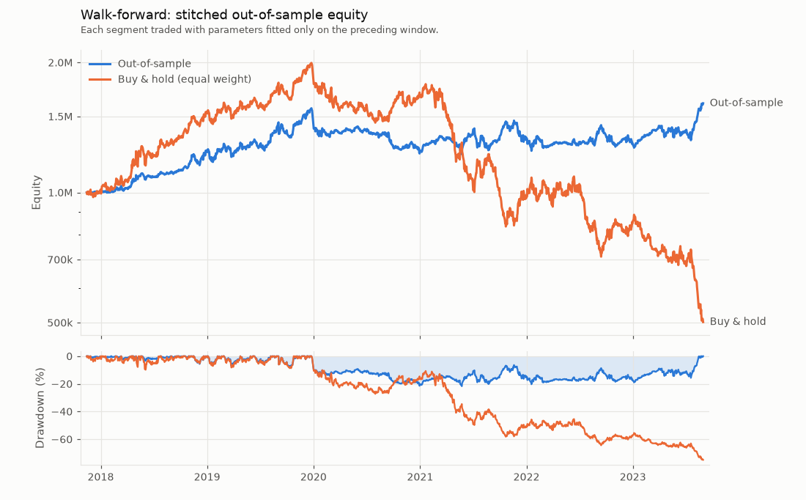

# User guide

- [Install](#install)
- [Command line](#command-line)
- [Writing a strategy](#writing-a-strategy)
- [Orders](#orders)
- [Portfolio construction](#portfolio-construction)
- [Research: grid search, walk-forward, parallel runs](#research-grid-search-walk-forward-parallel-runs)
- [Validation](#validation)
- [Tear sheet](#tear-sheet)
- [Metrics](#metrics)
- [Performance](#performance)
- [Development](#development)
- [Project layout](#project-layout)

How fills are simulated, and why, is in [methodology.md](methodology.md).

## Install

```bash
git clone https://github.com/houssammehdi/event-backtester.git
cd event-backtester
python -m venv .venv && source .venv/bin/activate
pip install -e ".[dev,plot]"      # runtime needs only numpy and pandas
```

## Command line

Every command runs offline on a seeded synthetic market unless `--csv` is given
(long format with `date, symbol, open, high, low, close, volume`, or a directory with
one file per symbol).

```bash
backtest run --strategy tsmom --symbols 5 --years 10 --seed 42 --report tsmom.html
backtest validate --strategy tsmom --report selected.html    # overfitting and snooping
backtest walkforward --strategy tsmom --jobs 4               # rolling fits, stitched OOS
backtest run -s allocation -p method=hrp --universe multi    # 14 assets in 3 classes
backtest generate --out data/syn.csv
backtest run --strategy sma --csv data/syn.csv -p fast=20 -p slow=100 --plot out.png
backtest strategies                                          # strategies and parameters
```

`--plot` saves a static chart with matplotlib (the `plot` extra): equity and drawdown
for `run` ([example](equity_curve.png), from `backtest run --strategy tsmom --symbols 5
--years 10 --seed 42 --plot docs/equity_curve.png`), the stitched out-of-sample curve
for `walkforward` (shown [below](#research-grid-search-walk-forward-parallel-runs)).

Common options: `--slippage-bps`, `--impact ETA` (square-root impact),
`--commission-bps`, `--per-share RATE`, `--participation`, `--max-gross`,
`--max-weight`, `--max-drawdown` (kill switch), `--borrow-rate`, `--cash`.
`validate` and `walkforward` take `--grid key=v1,v2` (repeatable) and `--jobs N`
(`-1` for one worker per CPU); `validate` also takes `--benchmark cash|buyhold`,
`--pbo-splits`, `--cpcv-groups`, `--cpcv-test` and `--embargo`.

## Writing a strategy

Subclass `Strategy` and implement `on_bar`. The view holds history up to the current
bar; the context holds the account and the order methods. Intents placed in `on_bar`
execute on later bars.

```python
import numpy as np

from backtester import DataFeed, Engine, MarketView, Strategy, StrategyContext, generate_ohlcv


class InverseVolTrend(Strategy):
    """Hold assets trading above their 100-bar mean, weighted by inverse volatility."""

    name = "inverse_vol_trend"

    def __init__(self, window: int = 100) -> None:
        self.window = window

    def on_bar(self, view: MarketView, ctx: StrategyContext) -> None:
        closes = view.filled_closes(self.window + 1)  # read-only; last row is *this* bar
        if len(closes) <= self.window or view.position % 21:  # rebalance every 21 bars
            return
        in_trend = closes[-1] > closes[1:].mean(axis=0)
        vol = np.diff(np.log(closes), axis=0).std(axis=0)
        raw = np.where(in_trend, 1.0 / vol, 0.0)
        weights = raw / raw.sum() if raw.sum() > 0 else raw
        ctx.target_weights(dict(zip(view.symbols, weights)))  # filled at the next open


feed = DataFeed(generate_ohlcv(n_symbols=5, years=10, seed=42))
result = Engine(feed, InverseVolTrend(), check_invariants=True).run()
print(f"Sharpe {result.metrics().sharpe:.2f}, final equity {result.final_equity:,.0f}")
# -> Sharpe 0.39, final equity 1,829,467
```

| Context call | Effect |
|---|---|
| `ctx.target_weights({...}, partial=False)` | Rebalance to fractions of equity at the next open. Symbols left out go to zero and working orders are cancelled; `partial=True` touches only the listed symbols |
| `ctx.order(sym, qty, order_type, limit_price=, stop_price=, trail_amount=, trail_percent=, tif=, oco_group=)` | Explicit signed order, reviewed by the risk manager; returns the order id |
| `ctx.bracket(sym, qty, entry_type, stop_loss=, take_profit=, trail_amount=, trail_percent=)` | Entry plus protective stop and/or target (see below); returns the three ids |
| `ctx.oco_group()` | A new one-cancels-other group id |
| `ctx.cancel(order_id)`, `ctx.cancel(symbol=...)`, `ctx.cancel()` | Cancel one order, a symbol's orders, or all |
| `ctx.position(sym)`, `ctx.positions()`, `ctx.weights()`, `ctx.cash`, `ctx.equity`, `ctx.open_orders()` | Account state; orders come back as copies |
| `view.window(field, n)`, `view.filled_closes(n)`, `view.series(sym, field, n)`, `view.history(...)`, `view.bar(sym)`, `view.price(sym)`, `view.timestamp`, `view.previous_timestamp` | Market data up to the current bar only |

Orders and targets for symbols outside the feed raise `OrderError` where they are
placed.

**Target-weight strategies.** A strategy whose decisions are target weights can
subclass `TargetWeightStrategy`: write the rule per bar (`desired_weights`) and over a
whole frame (`desired_weights_frame`), and pick a schedule (`"daily"`, `"monthly"`,
`"change"`). That enables the vectorized fast path, and the parity tests check the
two versions of the rule against each other. Rules that depend only on their window
can set `stateless = True`; on the monthly schedule they are then evaluated only on
the first bar of each month.

## Orders

```python
from backtester import OrderType, TimeInForce

# Buy-stop entry at the 20-day high, stop-loss and target at multiples of the range
# (examples/intrabar_sensitivity.py). The exits are armed by the entry's first fill.
ctx.bracket(
    "SYN01",
    300,
    OrderType.STOP,
    stop_price=breakout,
    stop_loss=breakout - 2 * atr,
    take_profit=breakout + 3 * atr,
)

# A trailing exit instead of a fixed stop: trails the high since the entry fill by 5%.
ctx.bracket("SYN01", 300, trail_percent=0.05, take_profit=target)

# One-cancels-other: whichever of the two fills first cancels the other.
group = ctx.oco_group()
ctx.order("SYN02", -100, OrderType.LIMIT, limit_price=110.0, oco_group=group, tif=TimeInForce.GTC)
ctx.order("SYN02", -100, OrderType.STOP, stop_price=95.0, oco_group=group, tif=TimeInForce.GTC)

# A stand-alone trailing stop starts trailing from this bar's close.
ctx.order("SYN03", -250, OrderType.TRAILING_STOP, trail_amount=2.5, tif=TimeInForce.GTC)

# Execute at the next close instead of the next open.
ctx.order("SYN04", 50, OrderType.MARKET_ON_CLOSE)
```

Rebalances from `target_weights` execute as market orders at the next open; with
`BacktestConfig(target_order_type=OrderType.MARKET_ON_CLOSE)` they execute at the next
close. The broker's `intrabar` setting (`"worst"` by default) decides the price path
on bars where it matters; see [methodology.md](methodology.md#13-the-intrabar-path).

## Portfolio construction

```python
from backtester import DataFeed, generate_multi_asset
from backtester.config import BacktestConfig
from backtester.portfolio import hierarchical_risk_parity_weights, ledoit_wolf
from backtester.strategies import AllocationStrategy

feed = DataFeed(generate_multi_asset(years=10, seed=42))  # 6 equities, 4 bonds, 4 commodities
result = BacktestConfig().run(feed, AllocationStrategy("erc", lookback=252))

returns = feed.frame("close").pct_change().iloc[-252:].to_numpy()
cov = ledoit_wolf(returns).covariance  # shrunk towards constant correlation
weights = hierarchical_risk_parity_weights(cov)
```

`AllocationStrategy(method)` rebalances monthly to one of `"ew"`, `"iv"` (inverse
volatility), `"minvar"`, `"meanvar"`, `"erc"` (equal risk contribution) or `"hrp"`,
estimated on the trailing `lookback` bars with Ledoit-Wolf shrinkage
(`covariance="ledoit_wolf" | "ledoit_wolf_identity" | "sample"`). The weight
functions and estimators are also available directly in `backtester.portfolio`.
[`examples/allocation_study.py`](../examples/allocation_study.py) compares the five
methods out of sample, with costs, and runs the validation tools on the comparison.

## Research: grid search, walk-forward, parallel runs

```python
from backtester import BpsCommission, DataFeed, FixedBpsSlippage, generate_ohlcv
from backtester.config import BacktestConfig
from backtester.research import grid_search, run_vectorized, walk_forward, walk_forward_windows
from backtester.strategies import TimeSeriesMomentum

feed = DataFeed(generate_ohlcv(n_symbols=5, years=10, seed=42))
config = BacktestConfig(slippage=FixedBpsSlippage(2), commission=BpsCommission(1))
grid = {"lookback": [63, 126, 252], "target_vol": [0.1, 0.2]}

search = grid_search(feed, TimeSeriesMomentum, grid, config=config)
search.table, search.best_params, search.deflated_sharpe
print(search.validate().format())  # PBO, SPA and Reality Check, CPCV paths

windows = walk_forward_windows(len(feed), train_size=756, test_size=252, start=252)
wf = walk_forward(feed, TimeSeriesMomentum, grid, windows, config=config)
print(wf.windows, wf.metrics(), wf.validate().format())

fast = run_vectorized(feed, TimeSeriesMomentum(), slippage_bps=2, commission_bps=1)
```

The same searches in four worker processes:

```python
if __name__ == "__main__":  # workers re-import the main module
    search = grid_search(feed, TimeSeriesMomentum, grid, config=config, n_jobs=4)
    wf = walk_forward(feed, TimeSeriesMomentum, grid, windows, config=config, n_jobs=4)
```

- **Walk-forward without leakage.** Every in-sample fit runs on a copy of the feed that
  ends at the last in-sample bar. The out-of-sample run replays earlier bars as
  warm-up (orders dropped) and starts flat at the first test bar, so the stitched
  curve pays the re-entry costs at every boundary. Test windows never overlap; `gap`
  adds an embargo; `anchored=True` gives an expanding window. Each window reports its
  in-sample deflated Sharpe ratio and PBO.
  `backtest walkforward --strategy tsmom --symbols 5 --years 10 --seed 42 --plot
  docs/walkforward_oos.png` draws the stitched curve:

  

- **Parallel runs.** `n_jobs=k` (or `-1` for every CPU) spreads the backtests over a
  process pool. Results are identical to the serial ones and come back in the same
  order (a test compares them field by field). The factory must be picklable - a
  class or a module-level function, not a lambda - and scripts need the usual
  `if __name__ == "__main__":` guard, because workers start with `forkserver`.
  Starting the workers is a fixed cost, so parallelism pays for grids that take more
  than a few seconds (see [Performance](#performance)).
- **Vectorized fast path.** For `TargetWeightStrategy` subclasses, `run_vectorized`
  uses the engine's accounting (size on the close, fill at the next open or, with
  `execution="close"`, the next close) and loops only over rebalance dates. The tests
  require agreement with the event engine to `rtol=1e-9` for every built-in strategy.

## Validation

```python
from backtester.validation import validate_returns

report = validate_returns(result.returns, periods_per_year=252, n_samples=2000)
print(report.format())
report.bootstrap["sharpe"].lower, report.sharpe.psr, report.sharpe.min_track_record_years
```

| Function | Question it answers |
|---|---|
| `validate_returns(returns, trial_sharpes=None)` | How uncertain is this strategy's performance? Bootstrap intervals, PSR, MinTRL, DSR when the trials are given |
| `validate_family(returns_matrix, benchmark)` (or `GridSearchResult.validate()`) | How much of the best result of a search is selection? Adds PBO, Reality Check, SPA and CPCV paths |
| `bootstrap_statistics`, `optimal_block_length` | Stationary-bootstrap distribution of any statistic |
| `probability_of_backtest_overfitting` | CSCV: PBO, logits, degradation, probability of loss |
| `superior_predictive_ability` | Hansen's SPA (consistent, lower, upper) and White's Reality Check |
| `PurgedKFold`, `CombinatorialPurgedCV`, `cpcv_backtest` | Cross-validation with purging and embargo, CPCV backtest paths |
| `probabilistic_sharpe_ratio`, `deflated_sharpe_ratio`, `min_track_record_length` | Sharpe-ratio inference |

The statistics, their assumptions and their calibration on simulated data are in
[methodology.md](methodology.md#3-validation-statistics).

## Tear sheet

```python
from backtester.validation import sample_moments

result.tear_sheet("tsmom.html")  # or: backtest run ... --report tsmom.html

# The best configuration of a search, with its deflated Sharpe ratio over all trials
trials = [sample_moments(search.returns[c])[0] for c in search.returns.columns]
search.best_result.tear_sheet("best.html", trial_sharpes=trials)
```

One HTML file with inline CSS, SVG and script, and no external resources: headline
figures, equity and drawdown against buy-and-hold, rolling Sharpe ratio and
volatility, monthly returns, the distributions of daily and trade returns, exposure,
the metrics tables and the validation section (bootstrap intervals, PSR, MinTRL, DSR
when trials are given, the bootstrap distribution of the Sharpe ratio). Charts have
tooltips (mouse and arrow keys), a table view, and light and dark themes.

## Metrics

`periods_per_year` defaults to 252; `r` are the simple per-bar returns of the equity
curve.

| Metric | Definition |
|---|---|
| Total return | `E_T / E_0 - 1` |
| CAGR | `(E_T / E_0)^(1 / years) - 1`, `years = (bars - 1) / periods_per_year` |
| Annual volatility | `std(r, ddof=1) * sqrt(ppy)` |
| Sharpe | `mean(r - rf/ppy) / std(r - rf/ppy) * sqrt(ppy)` |
| Sortino | `mean(r - rf/ppy) / DD * sqrt(ppy)`, `DD = sqrt(mean(min(r - rf/ppy, 0)^2))` over all bars |
| Max drawdown | `max(1 - E_t / max_{s<=t} E_s)` (the text report prints it as a positive fraction, the tear sheet as a loss) |
| Max drawdown duration | Longest run of bars below a previous peak |
| Calmar | `CAGR / max drawdown` |
| Hit rate, profit factor | Share of closed round trips with net PnL > 0; winners' net PnL over losers' |
| Turnover | Two-sided traded notional per year over average equity |
| Exposure, time in market | Mean gross exposure over equity; share of bars with a position |
| Beta, alpha | `cov(r, r_b) / var(r_b)`; `(mean(r) - beta * mean(r_b)) * ppy` |
| Tracking error, IR | `std(r - r_b) * sqrt(ppy)`; `mean(r - r_b) * ppy / TE` |
| Round trip | From a position leaving zero to its return to zero; flips are split, commission shared pro rata |

The benchmark is an equal-weight buy-and-hold of the universe, bought at the first
bar's close and never rebalanced.

## Performance

`scripts/benchmark_engine.py` times four scenarios on seeded synthetic data (2,520
daily bars, 2 bps slippage, 1 bps commission, 10 % participation cap) and prints the
final equity of each, so versions can be checked for identical results. Older
checkouts are measured with the same script through `PYTHONPATH`:

```bash
python scripts/benchmark_engine.py --repeat 7
PYTHONPATH=/path/to/v0.1.0/src python scripts/benchmark_engine.py --repeat 7
```

Median of 7 runs, the three versions interleaved round by round ("before tuning" is
0.2.0 with its new features but before the performance work):

| Scenario | 0.1.0 | 0.2.0 before tuning | 0.2.0 | bars/s |
|---|---|---|---|---|
| `tsmom_monthly_5`: time-series momentum, 5 symbols, monthly targets | 0.733 s | 0.680 s | 0.339 s | 7,434 |
| `sma_daily_20`: SMA crossover, 20 symbols, re-targeted every bar | 1.577 s | 2.011 s | 1.334 s | 1,889 |
| `brackets_5`: stop entries with bracket exits, 5 symbols | - | 3.965 s | 2.094 s | 1,203 |
| `allocation_hrp_14`: monthly HRP over 14 assets | - | 0.700 s | 0.413 s | 6,102 |

The machine was a shared 4-vCPU cloud VM (Intel Xeon, 2.8 GHz) running other jobs:
the 1-minute load average stayed between 7.1 and 8.2 during the measurement, so
absolute times are indicative and inflated; the ratios are more reliable. The final
equity of every scenario is identical in all versions that can run it.

What changed, found with `cProfile`: the new order machinery had made the
daily-rebalancing scenario 28 % slower than 0.1.0 (2.011 s against 1.577 s above),
and the engine spent much of its time boxing pandas timestamps and building
dictionaries. The tuned engine boxes the calendar once,
reads bars with `ndarray.item`, prices each bar once, values the book in one pass,
skips bars and path phases in which no order can act, copies orders field by field
when both intrabar paths must be simulated, and validates orders on a fast path.
`scripts/golden_outputs.py` gives identical digests for 25 diverse backtests before
and after these changes.

**Parallel grid search.** `scripts/benchmark_parallel.py` runs an 18-configuration
grid of time-series momentum on 10 symbols and checks that every setting returns the
serial result:

```text
$ python scripts/benchmark_parallel.py --repeat 3
18 configurations, 2520 bars x 10 symbols
CPUs available: 4
n_jobs=1   median   8.39 s   x1.00
n_jobs=2   median   6.43 s   x1.31
n_jobs=4   median   6.07 s   x1.38
(speed-ups relative to n_jobs=1; results identical across settings)
```

On the loaded VM described above (load average about 7.8 when the run started) the
workers competed with other jobs for the four cores, so this understates the
speed-up of an idle machine. Starting the workers (each imports NumPy and pandas and
receives the feed) is a fixed cost, so parallel runs pay off for searches that take
more than a few seconds.

## Development

```bash
ruff check . && ruff format --check . && mypy --strict src && pytest   # what CI runs
pytest -m slow                                  # the large Monte Carlo studies
python scripts/golden_outputs.py before.json    # digests of 25 diverse backtests
python scripts/benchmark_engine.py              # engine throughput
python scripts/benchmark_parallel.py            # grid-search speed-up
python scripts/validation_calibration.py        # size, power and coverage studies
```

The tests cover the accounting identities (Hypothesis), look-ahead (reading the
future raises; truncating the data leaves earlier results unchanged), fill rules per
order type and the intrabar path (property tests against independent references),
linked orders, cost models, risk limits and the kill switch, metrics against
hand-computed values, the validation statistics (against direct computations,
reference implementations and simulations with a known answer), the portfolio
methods, walk-forward leakage, vectorized-versus-event parity, parallel-versus-serial
equality, the tear sheet and the CLI.

`scripts/golden_outputs.py` hashes every output of 25 backtests that exercise all
strategies, order types and broker settings (including a random-order strategy); run
it before and after a change and compare the files to show the change alters no
result.

## Project layout

```text
src/backtester/
  engine.py          Engine (event loop) and BacktestResult
  events.py          event types and the priority EventQueue
  orders.py          order types, time in force, the Order record
  config.py          BacktestConfig: a fresh broker and risk manager for each run
  risk.py            limits, target sizing, the kill switch
  data/              DataFeed, MarketView, CSV loader, synthetic generators
  execution/         broker, intrabar path simulation, slippage and commission
  portfolio/         accounting, sizing, covariance estimators, allocation methods
  strategy/          Strategy, StrategyContext, TargetWeightStrategy
  strategies/        sma, tsmom, xsmom, bollinger, allocation
  analytics/         metrics, round trips, benchmark, text report, HTML tear sheet
  research/          grid search, walk-forward, parallel runner, vectorized path
  validation/        Sharpe inference, bootstrap, PBO, SPA, purged CV, reports
  cli.py             the `backtest` command
tests/               unit, property-based and integration tests
examples/            runnable studies (all offline)
scripts/             benchmarks, calibration, golden outputs, screenshots
docs/                this guide, the methodology, figures
```
